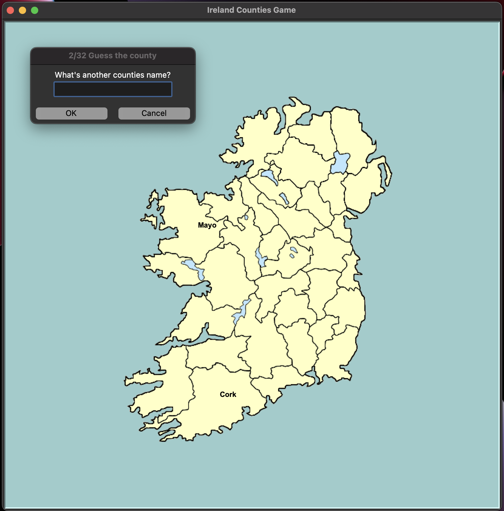

# snake-game 🐍

Recreated Snake with Python... Get it?  
- [The Project Folder](snake-game)

## Screenshot

 

# ireland-county-game 🇮🇪

Educational game that requires you to guess and learn all of the counties in Ireland.
Working with CSV files and analysing data with Pandas. 
- [The Project Folder](ireland-county-game)

### Screenshot

 

# turtle-crossing-game 🐢

Recreating Turtle Crossing with Python!  
- [The Project Folder](turtle-crossing-game)

## Screenshot

 

# pong-game 🏓

Recreating Pong with Python!  
- [The Project Folder](pong-game)

## Screenshot ☕️

 

# coffee-machine ☕️

A digital version of a coffee machine using Object Oriented Programming. Including multiple drink options, reporting, and money processing. With transaction and resources checks.  
- [The Project Folder](coffee-machine)
