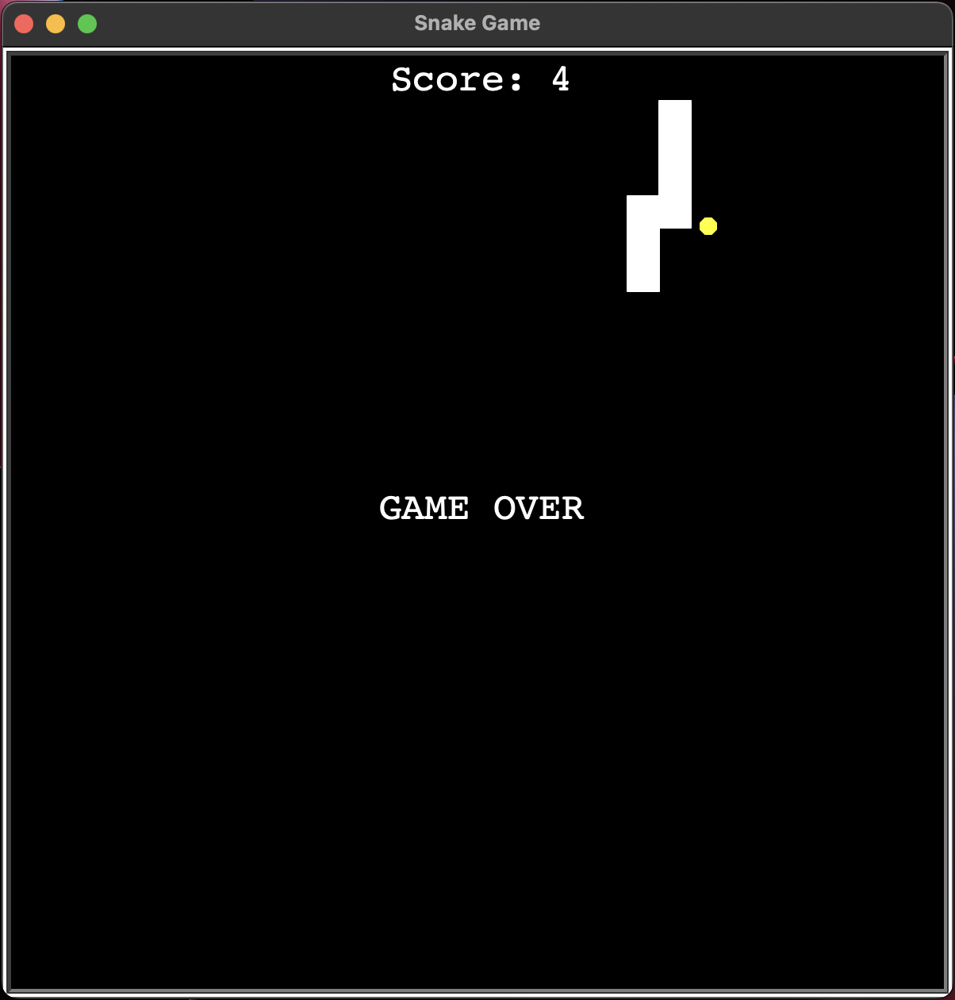

# snake-game 🐍

Recreated Snake with Python... Get it?

## Screenshot

 .

# ireland-county-game 🇮🇪

Educational game that requires you to guess and learn all of the counties in Ireland.
Working with CSV files and analysing data with Pandas.

### Screenshot

 .

# pong-game 🏓

Recreating Pong with Python.

## Screenshot ☕️

 .

# coffee-machine ☕️

A digital version of a coffee machine using Object Oriented Programming. Including multiple drink options, reporting, and money processing. With transaction and resources checks.
