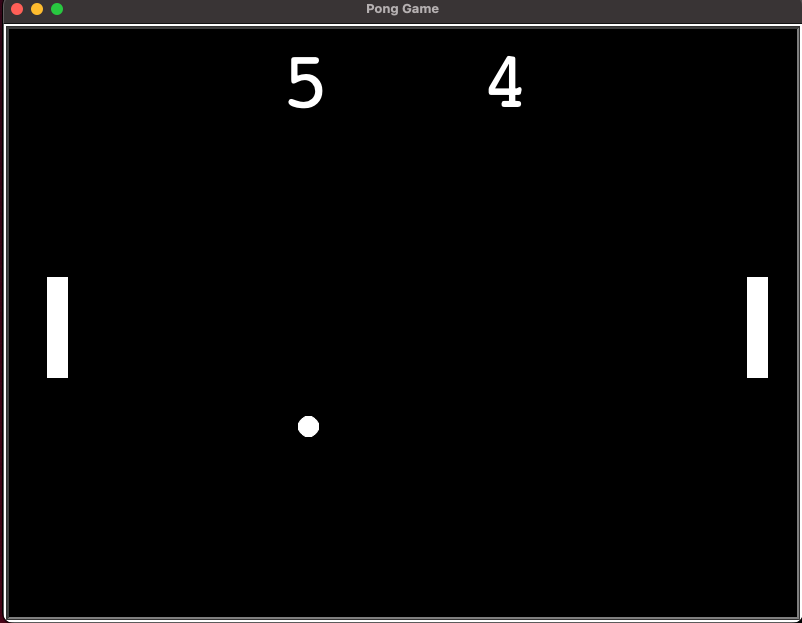

# pong-game

Recreating Pong with Python.

The steps involved;

- Create the screen
- Create and move a paddle
- Create another paddle for 2 player
- Create the ball and make it move
- Detect collision with wall and bounce
- Detect collision with paddle
- Detect when paddle misses
- Keep score

## Screenshot

