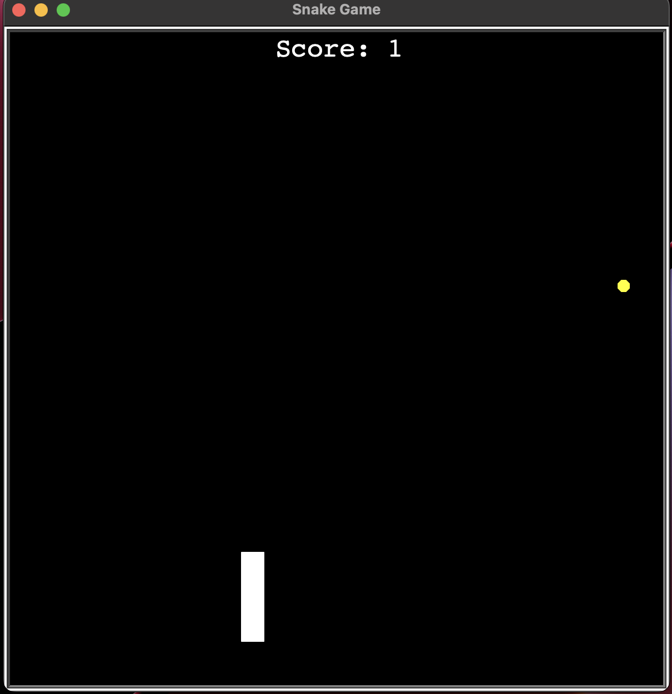

# snake-game

Recreating Snake with Python...

The steps involved are as follows;

- Creating the snake body
- Controlling the snake
- Detecting collisions with food
- Creating a scoreboard
- Detecting collision with a wall
- Detecting collisions with it's own tail

## Learning Objective

The Turtle module, Inheritance and slicing.

## Screenshot

