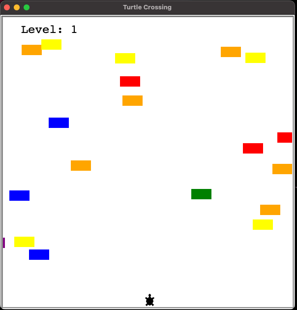

# turtle-crossing-game 🐢

Recreating Turtle Crossing with Python!

The steps involved;

- Move the turtle with a key press
- Create and move the cars
- Detect collision with a car
- Detect when the turtle reaches the other side
- Create a scoreboard

## Screenshot

